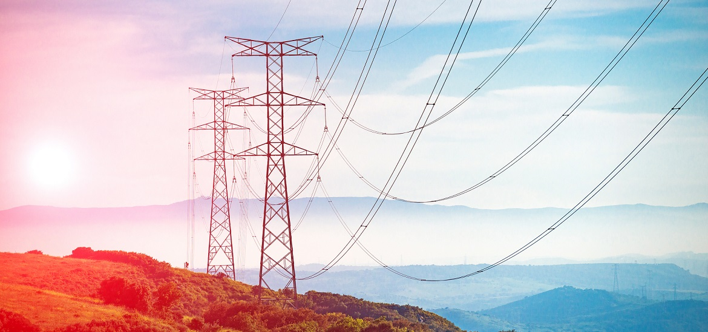

<!-- STYLE -->
<div style="text-align: justify">

<!-- TOP LINK -->
<a name="readme-top"></a>

<!-- SOCIAL MEDIA LINKS -->
<a href="https://github.com/M-Espinos-Longa">
  
</a>
&nbsp
<a href="https://www.linkedin.com/in/marc-espinos-longa/">
  
</a>
&nbsp
<a href="https://twitter.com/EspinosMarc">
  
&nbsp
<a href="https://marcespinoslonga.wordpress.com/">
  
</a>
&nbsp
<a href="https://orcid.org/0000-0001-7916-9383">
  
</a>

<!-- COVER -->
<p align="center">
  <div align="center">
    <a href="https://www.transformer-technology.com/news/us-news/1898-national-grid-uk-to-acquire-western-power-distribution-from-ppl.html">
      
    </a>
    <h1 align="center"><strong> UK Active Power Demand Time-Series Forecast via Artificial Neural Networks</strong></h1>
    <p>
      Authors: Marc Espinós Longa <br/>
      Date: 16 Feb 2023
    </p>
  </div>
</p>


<!-- TABLE OF CONTENTS -->
<details>
  <summary><strong> Table of Contents </strong></summary>
  <ol>
    <li><a href="#abstract"> Abstract </a></li>
    <li>
      <a href="#requirements"> Requirements </a>
      <ul>
        <li><a href="#installation">Installation</a></li>
      </ul>
    </li>
    <li><a href="#running-the-code"> Running the Code </a></li>
    <li><a href="results">Results</a></li>
    <li><a href="#citation">Citation</a></li>
    <li><a href="#acknowledgements">Acknowledgements</a></li>
    <li><a href="#references">References</a></li>
  </ol>
</details>


<!-- ABSTRACT -->
<a name="abstract"></a>

## Abstract
In recent years, electricity generation has been transitioning towards zero-emission (green) energy sources. These processes often rely on external and non-controllable variables (e.g., weather conditions), making electricity production erratic and intermittent. To avoid energy shortage, the system must have an alternative supply that responds to the required demand when necessary. As energy storage is only feasible on a small to medium scale, electricity distributors need to look ahead and plan energy supply based on future power demand.

Based on historical data extracted every 30 min. between 2017 and 2022, we will train and test an artificial neural network (ANN) that can efficiently forecast (RMSE<sup>1</sup> <= 12.416) future power demand (MW<sup>2</sup>) in an interval of 30 minutes given 12 hours of previous input data.

<font size="-1"><sup>1</sup> Root mean square error is often used as an accuracy measure in time-series forecasting <a href="#r1">[1-4]</a>. </br>
<sup>2</sup> Megawatts.</font>

<p align="right">(<a href="#readme-top">back to top</a>)</p>


<!-- REQUIREMENTS -->
<a name="requirements"></a>

## Requirements
This project is built in Python 3.10.6 and Linux operating system. However, all the included libraries are compatible with macOS and Windows. We can easily check your current Python 3 version by running `python3 --version` command on our terminal.

List of libraries:
<ul>
  <li>Pandas: read dataset file.</li>
  <li>Pytorch: neural networks and related.</li>
  <li>Wandb: real-time performance tracking (optional).</li>
  <li>Matplotlib: graph visualisation.</li>
  <li>Tqdm: computing process visualisation on terminal.</li>
  <li>Numpy: random seed generator for experiment reproducibility.</li>
</ul>


<!-- INSTALLATION -->
<a name="installation"></a>
### Installation
We will use <a href="https://pypi.org/project/pip/">pip</a> package installation tool to build our set-up. It is considered good practice to update our package information from all configured sources before making any installation. We can do that simply by running the following command:

```sh
sudo apt-get update
```

If we have already Python 3 installed in our system, we can execute the command

```sh
sudo apt-get -y install python3-pip
```

We are now ready to install all the required packages.

1. [Pandas](https://pandas.pydata.org/docs/getting_started/install.html):
```sh
pip install pandas
```

2. [PyTorch CUDA](https://pytorch.org/) (to solve this particular problem, it is okey to use the CPU version. Nonetheless, I do recommend you to get used to work with your GPU as for larger problems, parallel computing will reduce significantly our runtimes):
```sh
pip install torch torchvision torchaudio --extra-index-url https://download.pytorch.org/whl/cu116
```

3. [Wandb](https://pypi.org/project/wandb/):
```sh
pip install wandb
```

4. [Matplotlib](https://pypi.org/project/matplotlib/):
```sh
pip install matplotlib
```

5. [Tqdm](https://pypi.org/project/tqdm/):
```sh
pip install tqdm
```

6. [Numpy](https://numpy.org/install/):
```sh
pip install numpy
```

The provided package links will show you additional installation options in case you wish to use another package installation tool such as `conda`. Also, you may probably want to use `pip3` instead.

<p align="right">(<a href="#readme-top">back to top</a>)</p>

<!-- RUNNING THE CODE -->
<a id="running-the-code"></a>

## Running the Code

Our main file is <a href="code/forecasting.py">forecasting.py</a>. To execute it, first `cd` into <a href="code">code</a> folder, and then execute:

```sh
python3 forecasting.py
```

If we decide to use wandb for real-time performance tracking, we need to make sure the pipeline is properly initialised by adding our wandb ID (we will need to sign up with wandb first).

```python
# initialise training log data
wandb.init(project="Forecasting", name=f"Training",
    notes=f"hu=[8], \
    lr=1e-04, \
    batch_size=32, \
    activation_func=None, \
    epochs=30, \
    look_back=24, \
    entity=wandbID") # fill in with your wandb ID (you will need to sign up at https://wandb.ai/site)
```

This repository already contains <a href="data/data.xlsx">data.xlsx</a> in two different datasets; one for training (<a href="data/trainInput.pt">trainInput.pt</a>, <a href="data/trainOutput.pt">trainOutput.pt</a>) and the other one for testing (<a href="data/testInput.pt">testInput.pt</a>, <a href="data/testOutput.pt">testOutput.pt</a>). Data split is 90% for training and validation, and 10% for testing. If you want to add your own data files, be sure to make the proper arrangements in

```python
data = pd.read_excel('data.xlsx', sheet_name='Sheet1', usecols=[0, 1], skiprows=[0], header=None) # read
```

and uncomment the entire `# data management` section in <a href="code/forecasting.py">forecasting.py</a>.

After initialising the ANN model via

```python
# model init
net = ANN()
net.init()
```

we can directly load our <a href="weights/trainingWeights.tar">trainingWeights.tar</a> and estimate future power demand through `net.prediction()`. By default, our predicted data considers 40 intervals of 30 minutes forward in time. If you wish to go further, you can replace 40 in the following code chunk

```python
for i in range(40):
    val = self.network(eval) # prediction
    predictions.append(val.squeeze(0).detach().to("cpu")) # append results
    eval = torch.cat((eval, val), 0) # add prediction to input tensor
    eval = eval[-24:] # take last 24 input elements
```

in <a href="code/ANN.py">ANN.py</a>. Your output will be automatically saved in <a href="data/predictions.txt">predictions.txt</a>.

Alternatively, we can load the generated dataset(s) by uncommenting the `# load data` section, and train/test our model with


```python
# train and test model
net.train(training_data_input, training_data_output, wandb)
# net.load("training") # (SKIP THIS LINE)
net.test(testing_data_input, testing_data_output)
```

Note that it is not necessary to load the trained weights after training, as the model state dictionary (network parameters) are kept within our object. Nevertheless, <a href="code/ANN.py">ANN.py</a> automatically saves our trained weights in <a href="weights/trainingWeights.tar">trainingWeights.tar</a> after calling `net.train(training_data_input, training_data_output, wandb)`.

<p align="right">(<a href="#readme-top">back to top</a>)</p>

<!-- RESULTS -->
<a name="results"></a>

## Results

* Model performance:


&nbsp

&nbsp


* Model test and predictions:


&nbsp


<p align="right">(<a href="#readme-top">back to top</a>)</p>


<!-- CITATION -->
<a name="citation"></a>

## Citation

```
@web_page{,
   author = {Marc Espinos Longa},
   month = {2},
   title = {UK Active Power Demand Time-Series Forecast via Artificial Neural Networks},
   url = {https://github.com/M-Espinos-Longa/power-demand-forecast},
   year = {2023},
}
```

<p align="right">(<a href="#readme-top">back to top</a>)</p>


<!-- ACKNOWLEDGMENTS -->
<a name="acknowledgements"></a>

## Acknowledgments

* [Othneil Drew, Best README Template](https://github.com/othneildrew/Best-README-Template)
* [Jon Schlinkert, Markdown Cheatsheet](https://gist.github.com/jonschlinkert/5854601)

<p align="right">(<a href="#readme-top">back to top</a>)</p>


<!-- REFERENCES -->
<a name="references"></a>

## References

<a name="r1"></a>

1. Georga, E. I., Fotiadis, D. I., & Tigas, S. K. (2018). Nonlinear Models of Glucose Concentration. *Personalized Predictive Modeling in Type 1 Diabetes*, 131–151. [https://doi.org/10.1016/B978-0-12-804831-3.00006-6](https://doi.org/10.1016/B978-0-12-804831-3.00006-6).

2. Christie, D., & Neill, S. P. (2022). Measuring and Observing the Ocean Renewable Energy Resource. *Comprehensive Renewable Energy*, 149–175. [https://doi.org/10.1016/B978-0-12-819727-1.00083-2">https://doi.org/10.1016/B978-0-12-819727-1.00083-2](https://doi.org/10.1016/B978-0-12-819727-1.00083-2">https://doi.org/10.1016/B978-0-12-819727-1.00083-2).

3. Functional Networks. (2005). In *Mathematics in Science and Engineering* (Vol. 199, Issue C, pp. 169–232). Elsevier. [https://doi.org/10.1016/S0076-5392(05)80012-8](https://doi.org/10.1016/S0076-5392(05)80012-8).

4. Tiwari, K., & Young Chong, N. (2020). Informative Path Planning (IPP): Informative area coverage. *Multi-Robot Exploration for Environmental Monitoring*, 85–99. [https://doi.org/10.1016/B978-0-12-817607-8.00021-6](https://doi.org/10.1016/B978-0-12-817607-8.00021-6).

<p align="right">(<a href="#readme-top">back to top</a>)</p>

</div>
